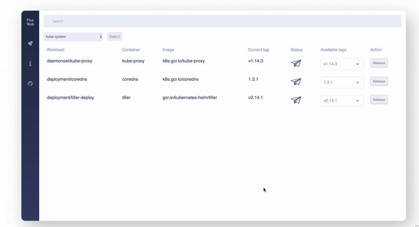

# flux-web
[](http://hits.dwyl.io/flux-web/flux-web) [](https://github.com/dwyl/esta/issues) [](https://goreportcard.com/report/github.com/flux-web/flux-web) [](https://travis-ci.com/flux-web/flux-web)



> If you don't know what *GitOps* is then we highly encourage you to read [Weavework blog](https://www.weave.works/technologies/gitops/) and [flux](https://github.com/fluxcd/flux) for the implemention.

flux-web is used for manual actions against flux's api:
* list current workloads
* dynamic namespaces overview
* workload's version promotion or rollback

## Reasoning

When using `flux` your pipelines, or to be more precise, your Continues Deployments are fully automated and that's great.
But, sometimes we would like to have more stable environments with fewer deployments and with more control, for example, production.
That's mean we need to do some manual actions against `flux` which have his own CLI tool `fluxctl`.

flux-web is intended to be the UI approach to this problem. With flux-web we can view at our workloads per namespace with their available versions and with a single click we can promote a workload or to perform a rollback.

## Getting Started

The easiset way to deploy flux-web is with helm:
```shell
git clone git@github.com:flux-web/flux-web.git
cd flux-web/chart/flux-web
kubectl create ns flux
helm install . --name flux-web \
               --set namespace=flux
```
Or, for an example we can deploy flux-web as readonly mode:
```shell
helm install . --name flux-web \
               --set namespace=flux
               --set frontend.env.READ_ONLY=true
```

Deploying flux-web with `HelmRelease`:
```
---
apiVersion: flux.weave.works/v1beta1
kind: HelmRelease
metadata:
  name: flux-web
  namespace: flux
spec:
  releaseName: flux-web
  chart:
    git: git@github.com:flux-web/flux-web.git
    path: chart/flux-web
    ref: master
  values:
    frontend:
        env:
          API_EXTERNAL_URL: //flux-web.my-domain/api/v1
          WS_URL: wss://flux-web.my-domain/ws/v1
    ingress:
      hosts:
        - host: flux-web.my-domain.io
          paths: 
            - frontend: /
            - backend: /api
            - backend: /ws
```

## Continued Development

Basically a roadmap.

### Coming soon

- filter workloads - ✓
- scroll over workload's versions - ✓
- readonly mode - ✓
- turn on/off flux automation on a workload
- features you'd like to see?

### Maybe in the future, if people want it

- user access and authentication

### Probably in the future

- select and release multiple workloads

## Built With

* [beego](https://beego.me/) - Backend framework
* [go](https://golang.org/) - Programing language
* [vue.js](https://vuejs.org/) - Frontend framework
* [nuxt.js](https://nuxtjs.org/) - Giving vue.js the ability to do ssr
* [docker](https://www.docker.com/) - Containerized with docker
* [helm](https://www.helm.sh/) - Packaged with helm


## Contributing

Code contributions are very welcome. If you are interested in helping make flux-web great then feel free!

## Authors 

* [Ido Braunstain](https://github.com/idobry) - *Initial work*
* [Yohanan Baruchel](https://github.com/ybaruchel) - *Initial work*
